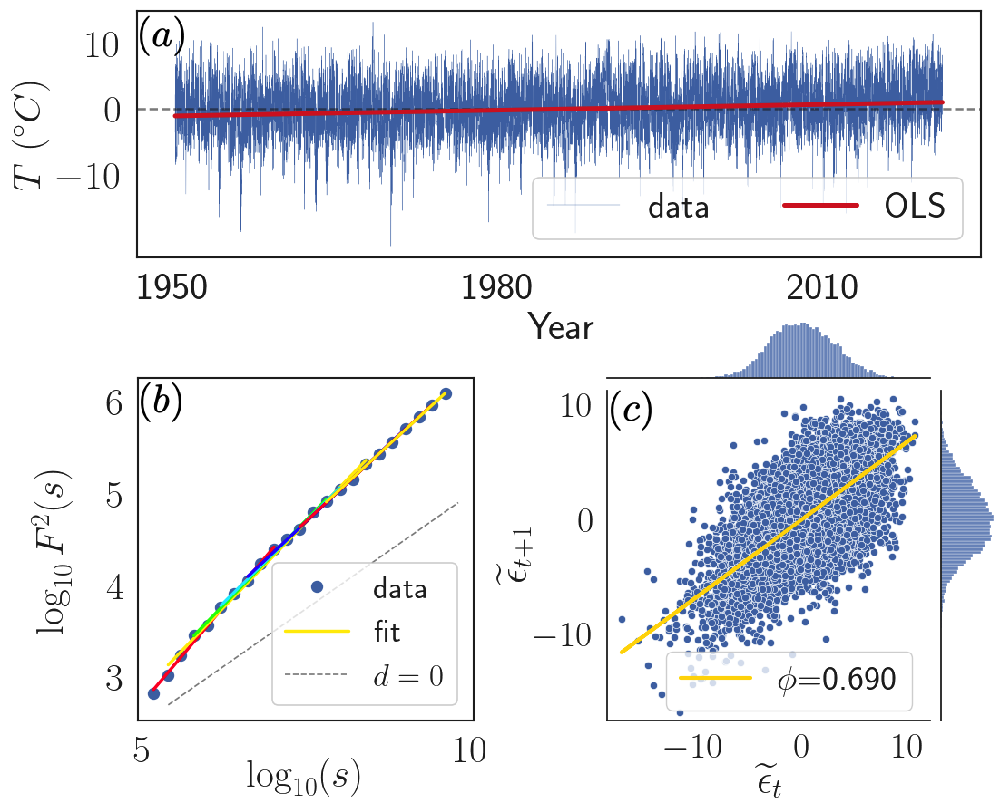

# Short and Long Range Correlations of Single Time Series

Code for trend analysis in the presence of long and short range correlations. These results are a selection of results of the paper: "Trend Analysis in the Presence of Short- and Long-Range Correlations with Application to Regional Warming", Phys Rev E, Phillips E. T., Höll M., Kantz H., Zhou Y, 2023.

The code here focuses on analysis of a single time series. For results on spatial analysis take a look at the repository 'eof_trend_analysis'.

